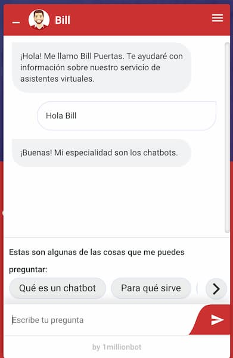
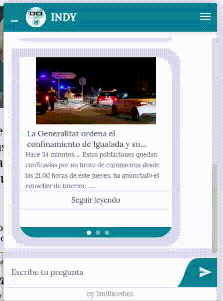
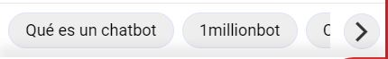

# 1millionBot Chat Challenge

## Introduction

At 1millionbot we care a lot about the service and image we provide to our clients. The first contact that our users have with us is our chat window where they can interact with our chatbots. This chat is where the ✨*magic*✨ of 1millionbot happens and that's why it's so important to us.

## Description

Your task is simple, you have to **create a chat window** for our chatbots. You can use [our chat window](./examples/chat-screenshot.jpg) as a guide but feel free to design it as you like.

To accomplish it you must follow the following points:

- You can use vanilla JS or any framework, bonus points if it is [Angular](https://angular.io/).
- The messages from the chatbot must be different from the user ones, positioning them right and left its the easiest way to fullfill this one 😉.
- The image and the name of the chatbot must appear so that the user knows at all times who they are talking to.
- The chat window must have a [drop-down menu](./examples/drop-down-menu.png) to select options such as forgetting user data, changing the language or accessing the privacy policy.
- Our chatbots not only send text messages, you will have to implement:
  - Image-card messages
  
    
  - Chat Buttons
  
    
  - Other kind of messages or enhancements you want to implement and think would be a nice implementation
- The design does not have to be super sophisticated, but it must at least responsive and **full-screen on mobile phones**. 

## Bonus points

- Dockerize the app.
- Pre chatbot call to action display.
- Write realistic unit/end-to-end tests.